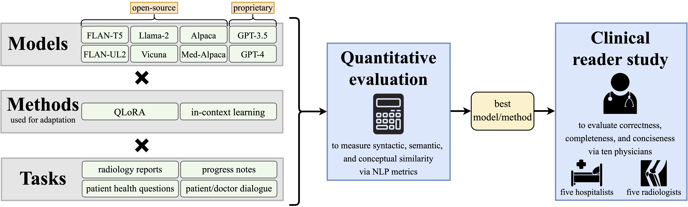

# Clinical Text Summarization by Adapting LLMs

Official implementation from Stanford University, coming soon!<br>
- <b> Title: </b>[Clinical Text Summarization: Adapting Large Language Models Can Outperform Human Experts](https://arxiv.org/pdf/2309.07430.pdf)<br>
- <b>Authors: </b>[Dave Van Veen](https://davevanveen.com/), Cara Van Uden, Louis Blankemeier, Jean-Benoit Delbrouck, Asad Aali, Christian Bluethgen, Anuj Pareek, Malgorzata Polacin, Eduardo Pontes Reis, Anna Seehofnerova Nidhi Rohatgi, Poonam Hosamani, William Collins, Neera Ahuja, Curtis P. Langlotz, Jason Hom, Sergios Gatidis, John Pauly, Akshay S. Chaudhari 
- <b>Contact: </b>{vanveen} [at] stanford [dot] edu<br>



## Code and Data

We will soon publish our code and pre-processed data. Feel free to star the repo so you don't miss it.

## Citation

```
@misc{vanveen2023clinical,
      title={Clinical Text Summarization: Adapting Large Language Models Can Outperform Human Experts}, 
      author={Dave Van Veen and Cara Van Uden and Louis Blankemeier and Jean-Benoit Delbrouck and Asad Aali and Christian Bluethgen and Anuj Pareek and Malgorzata Polacin and William Collins and Neera Ahuja and Curtis P. Langlotz and Jason Hom and Sergios Gatidis and John Pauly and Akshay S. Chaudhari},
      year={2023},
      eprint={2309.07430},
      archivePrefix={arXiv},
      primaryClass={cs.CL}
}
```
