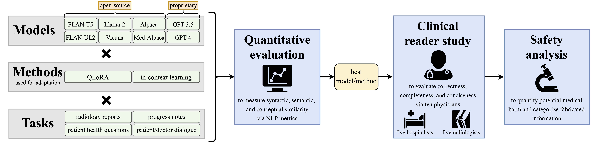

# Clinical Text Summarization by Adapting LLMs

Official implementation from Stanford University<br>
- <b> Title: </b>[Adapted Large Language Models Can Outperform Medical Experts in Clinical Text Summarization](https://arxiv.org/pdf/2309.07430.pdf)<br>
- <b>Authors: </b>[Dave Van Veen](https://davevanveen.com/), Cara Van Uden, Louis Blankemeier, Jean-Benoit Delbrouck, Asad Aali, Christian Bluethgen, Anuj Pareek, Malgorzata Polacin, Eduardo Pontes Reis, Anna Seehofnerova Nidhi Rohatgi, Poonam Hosamani, William Collins, Neera Ahuja, Curtis P. Langlotz, Jason Hom, Sergios Gatidis, John Pauly, Akshay S. Chaudhari 
- <b>Contact: </b>{vanveen} [at] stanford [dot] edu<br>




## Datasets
We use six pre-existing open-source datasets which are publicly accessible at the sources cited in our manuscript. Additionally, for datasets which do not require PhysioNet access, we provide our versions in `data/`: 
- `opi`: Open-i (radiology reports)
- `chq`: MeQSum (patient/consumer health questions)
- `d2n`: ACI-Bench (dialogue)

## Models
In addition to proprietary models GPT-3.5 and GPT-4, we adapt the following open-source models available from HuggingFace:
- [FLAN-T5](https://huggingface.co/google/flan-t5-xl)
- [FLAN-UL2](https://huggingface.co/google/flan-ul2)
- [Alpaca](https://huggingface.co/chavinlo/alpaca-native)
- [Med-Alpaca](https://huggingface.co/medalpaca/medalpaca-7b)
- [Vicuna](https://huggingface.co/AlekseyKorshuk/vicuna-7b)
- [Llama-2](https://huggingface.co/meta-llama/Llama-2-7b-hf)

## Code

### Set-up

1. Use these commands to set up a conda environment:
```
conda env create -f env.yml
conda activate clin-summ 
```
2. In `src/constants.py`, create your own project directory `DIR_PROJECT` outside this repository which will contain input data, trained models, and generated output.
3. Move input data from this repo to `DIR_PROJECT`, i.e. `mv data/ DIR_PROJECT`
4. (optional) To add your own dataset, follow the format of example datasets `opi`, `chq`, and `d2n` in `DIR_PROJECT/data/`


### Usage

Below is a description of relevant scripts:

- `./main.sh`: Fine-tune open-source models, query, and compute metrics
- `python api/main.py`: Query OpenAI models and compute metrics
    - first enter information for your Azure deployment in `src/constants.py` via `RESOURCE` and `API_KEY`
- `python src/gen_faiss_idx.py`: (new datasets only) Determine set of nearest neighbors training examples for each sample. Alternatively you can sample training examples at random.
- `src/UMLSScorer.py`: Class definition for the MEDCON metric. To implement, follow these steps:
    1) Acquire approval for a [UMLS license](https://www.nlm.nih.gov/research/umls/index.html)
    2) Follow the [UMLS download instructions](https://github.com/Georgetown-IR-Lab/QuickUMLS)
    3) Adapt the provided script, `src/UMLSScorer.py`
    4) Call using the following two lines:
        - `scorer = UMLSScorer()`
        - `medcon_score = scorer(string1, string2)`

## Citation

```
@misc{vanveen2023clinical,
      title={Clinical Text Summarization: Adapting Large Language Models Can Outperform Human Experts}, 
      author={Dave Van Veen and Cara Van Uden and Louis Blankemeier and Jean-Benoit Delbrouck and Asad Aali and Christian Bluethgen and Anuj Pareek and Malgorzata Polacin and William Collins and Neera Ahuja and Curtis P. Langlotz and Jason Hom and Sergios Gatidis and John Pauly and Akshay S. Chaudhari},
      year={2023},
      eprint={2309.07430},
      archivePrefix={arXiv},
      primaryClass={cs.CL}
}
```
